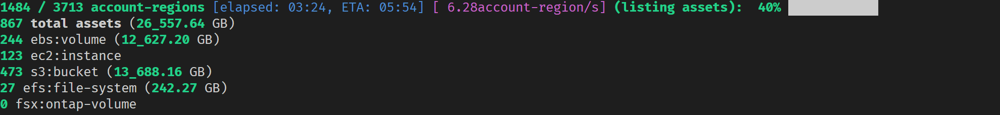

# Elastio Inventory collector

Elastio Inventory Collector is a Python script, that lists resources in your AWS accounts. It can operate both within a single account and multiple accounts. You can also run it from the management AWS account and let it discover resources in the specified org unit or all accounts in your organization.

The script displays the progress of discovery while it's running, showing you the summary of resources and their sizes that it has discovered so far:



Once it finishes, the script creates a file `inventory.csv` in the directory from which it was run. This CSV file contains the full information about every asset the script has discovered, which may be used for further analysis.

You may load the resulting CSV into MS Excel or Google Sheets and sort your resources by the data size and number of files on them to detect potentially unused big EBS volumes, S3 buckets etc. in your environments.

## Installation

You can run the Inventory Collector in AWS Cloudshell, but it'll run painfully slow because the Cloudshell instance has only 1 vCPU and minimal RAM. It's recommended that you run this script on a multi-core system for better performance.

Run the following commands to install the Inventory Collector script:

```bash
pip3 install boto3 botocore tqdm

curl -LO https://raw.githubusercontent.com/elastio/contrib/refs/heads/master/inventory-collector/inventory-collector.py

# Required on Unix
chmod +x ./inventory-collector.py
```

Check the script's `--help` for details on how you can select the accounts/regions you want to collect inventory from. For example, this is how you can list resources from all accounts (make sure to run the script from the management account in this case):

```bash
./inventory-collector.py --all-accounts
```
